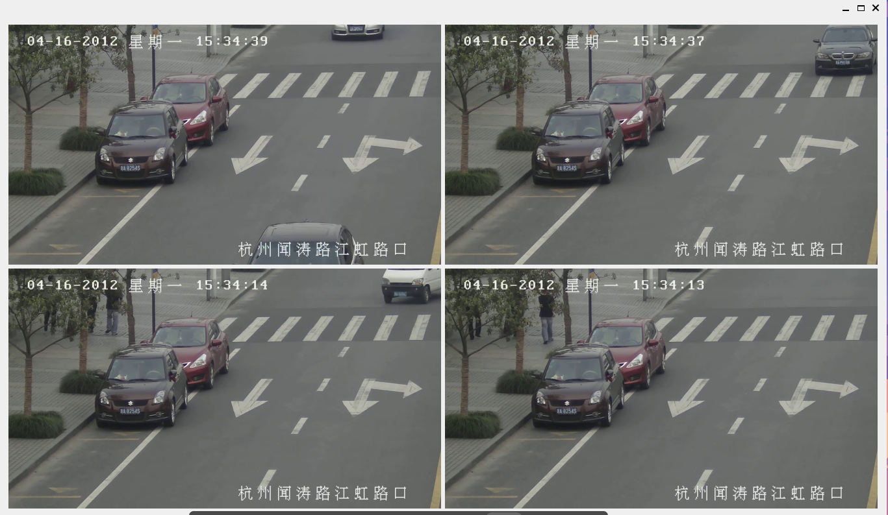

# **QtSocketPlay**

### **Overview**
QtSocketPlay is a real-time video streaming application built with Qt and FFmpeg. It supports multiple client connections and streams video efficiently using socket-based communication. The project demonstrates advanced usage of multimedia processing, threading, and networking within a C++/Qt framework.

---

### **Features**
- **Real-time Streaming:** Streams video frames to multiple clients with low latency.
- **Dynamic Layout Management:** Automatically adjusts the UI layout based on the number of active streams.
- **Multithreaded Architecture:** Uses QThread for handling network communication and streaming tasks.
- **FFmpeg Integration:** Leverages FFmpeg for video decoding and processing.
- **Memory Leak Detection:** Built with AddressSanitizer to ensure efficient resource management.

---

### **Technologies Used**
- **Qt Framework**: For GUI and networking.
- **FFmpeg**: For multimedia processing.
- **C++17**: For core application logic.
- **AddressSanitizer**: For detecting memory issues.

---

### **Requirements**
- **Operating System:** Linux (tested on Ubuntu 22.04)
- **Libraries:**
  - Qt6 or Qt5
  - FFmpeg (libavutil, libavcodec, libavformat, etc.)
  - GCC or Clang with AddressSanitizer support
- **Build Tools:** CMake

---

### **Installation**
1. **Clone the Repository**
   ```bash
   git clone https://github.com/username/QtSocketPlay.git
   cd QtSocketPlay
   ```

2. **Install Dependencies**
   ```bash
   sudo apt update
   sudo apt install build-essential cmake qtbase5-dev libavcodec-dev libavformat-dev libavutil-dev
   ```

3. **Build the Project**
   ```bash
   mkdir build
   cd build
   cmake .. -DCMAKE_BUILD_TYPE=Debug
   make
   ```

4. **Run the Application**
   ```bash
   ./QTserver   # For server
   ./QTclient   # For client
   ```

---

### **Usage**
1. Start the server by running `QTserver`.
2. Launch multiple client instances (`QTclient`) to connect to the server.
3. Observe the dynamic UI layout update as more clients join.
4. Use the `AddressSanitizer` build to monitor for memory issues:
   ```bash
   ASAN_OPTIONS=detect_leaks=1 ./QTserver
   ```

---

### **Project Structure**
```
QtSocketPlay/
├── client/                  # Client-side implementation
│   ├── client.cpp           # Main client logic
│   ├── Encoder.h            # Encoder class for video encoding
├── server/                  # Server-side implementation
│   ├── server.cpp           # Main server logic
│   ├── StreamManager.h      # Manages client streams
├── ui/                      # User interface components
│   ├── mainwindow.ui        # Qt Designer file for the UI
├── CMakeLists.txt           # Build configuration
└── README.md                # Documentation (this file)
```

---

### **Known Issues**
- **QThread Warning:** Ensure threads are cleaned up properly before the application exits.
- **Memory Leaks:** Use AddressSanitizer to detect and resolve leaks.
- **Segmentation Faults:** Verify resource deallocation during multithreaded operations.

---

### **Future Enhancements**
- Add support for video encoding to H.264 or HLS.
- Improve error handling for client-server communication.
- Add unit tests for core functionality.
- Enhance layout management for edge cases (e.g., very high or low client counts).

---

### **Contributing**
Contributions are welcome! Feel free to submit a pull request or open an issue for any bugs or feature requests.

---

### **License**
[MIT License](LICENSE)

---

### **Screenshots**
Below is an example layout when 4 streams are active:



---